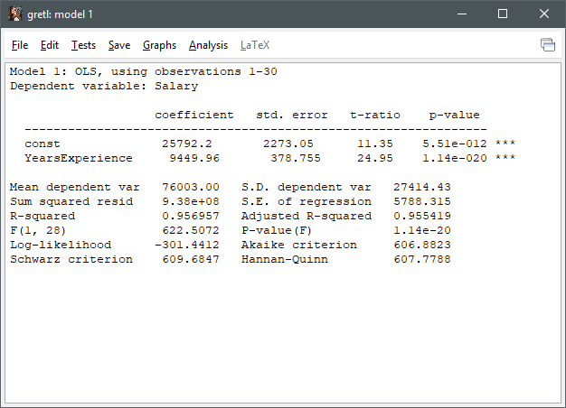
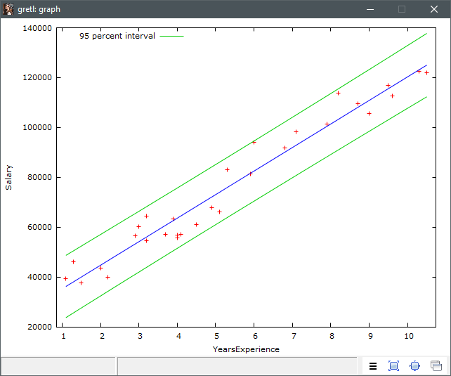
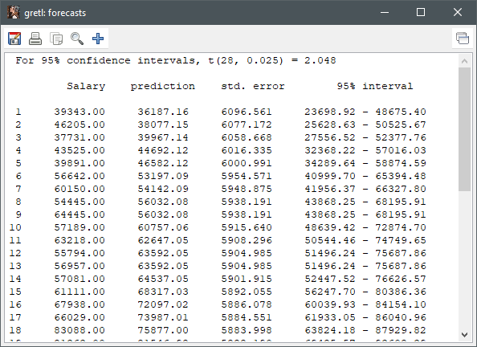

# Simple Linear Regression

## Import the Data

This report will look similar in Python, SAS, or whatever statistal application being used.

- Section 1
  - Model and number of observations
  - Dependent variable being observed
- Section 2
  - coefficient
    - const: Y intercept at 25792.2, meaning 0 years experience relates to 25792.2
    - YearsExperience: Per year experience, Salary is increased by 9449.96 (modeled)
    - std.error
    - t-ratio
    - p-value
      - Statistical significance of the variables
      - Smaller the value, the more significant the variable
        - Values over 0.5 (5%), means the relationship is not significant
- Section 3
  - R-squared
  - Adjusted R-squared

## Plotting the Graph

